<h4><a style="color:navy"; font-weight:normal; href="http://www.ini.uzh.ch/~kramer/pub/cas97.pdf"><u>Paper Referred</u></a>: Pulse-Based Analog VLSI Velocity Sensors</h4>
<h4>Authors: Jorg Kramer, Rahul Sarpeshkar, and Christof Koch</h4>
 
<h2>Why this research?</h2>

The research  in neuromorphic algorithms and bio-inspired hardware has gained a lot of research in recent years. In this direction, this paper tries to mimic the basic function of human eye, i.e., to detect a moving object and its direction of motion, and to calculate its approximate speed. The perception of the object is based upon change in illumination due to the object, as detected by photodiodes. The current from the photodiodes is then processed to calculate the desired features, via a circuit presented in this paper. Besides calcualating the results correctly, we aim to  have the following features in our system:
<ul>
<li> Real time detection of the features to interact with a dynamic environment </li>
<li> Small area and low power requirements so that it can be used in IoT sensors </li> 
<li> Low computation requirements to reduce cost of the sensor </li>
</ul>

There are two types of intensity based motion algorithms: gradient based and correlation based. The token-based methods are more promising as they work intwo stage: first extracting some specific features from the image like edges, corners, etc. and then, tracking these features across time to calculate velocity and direction of motion. Implementing this method with computer vision algorithms is generally computationally expensive and thus, we require a simple circuit to implement our token-based algorithms.

<h2>The Paper</h2>

The complete circuit described in the paper is divided into two parts: Feature extraction stage and velocity computation stage. For the first stage, the circuit called *Temporal Edge Detector* converts changes in irradiance at two different positions to thin current pulses. For the second stage, these current pulses are given as inputs to *Voltage Shaping Circuits* and *Motion Circuits* (one for each direction of motion).

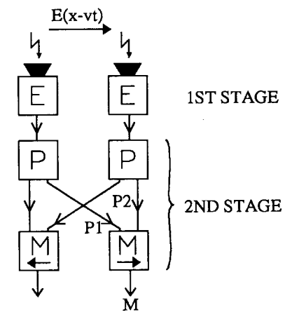

Note that temporal edge detector and pulse shaping circuit are shared between both directions' motion circuits to optimize resources and area.

There are two types of motion circuits: *facilitate and trigger* (FT) and *facilitate and sample* (FS). FT motion circuit measures the time overlap between the binary pulses produced by two adjacent pulse shaping circuits and FS motion circuit samples the time varying output of first pulse shaping circuit by a thin pulse produced by second pulse shaping circuit. See the below images for clarity:

  

  	<figure>
    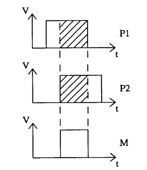
    <figcaption>FT Motion Circuit </figcaption>
</figure>

  

  

  	<figure>
    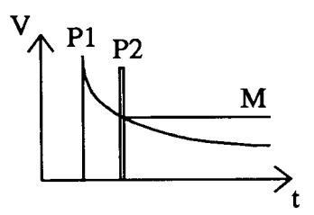
    <figcaption>FS Motion Circuit </figcaption>
	</figure>
  

Direction sensitivity is obtained by the fact that we get output only if P1 precedes P2.

<h3>Temporal Edge Detector</h3>

The Temporal Edge Detector Circuit converts a rapid increase in brightness to a current pulse. The circuit diagram is shown below:

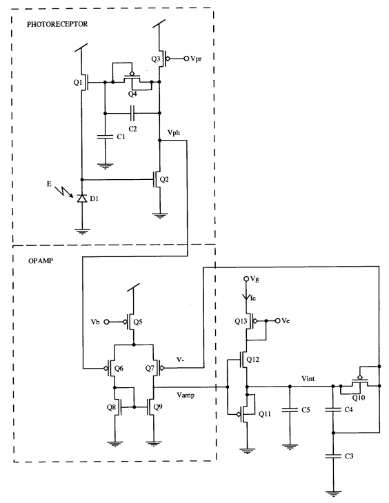

The diode D1, transistors Q1-Q4 and capacitors C1-C2 constitute a photoreceptor. This photoreceptor converts a change &Delta;E in illumination E to a change in output voltage &Delta;Vph as:

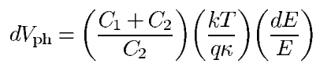

The output of the photoreceptor are the positive voltage spikes corresponding to ON stages. This is then converted to ON current by the next circuit. The transistors Q5-Q9 constitute an operational amplifier with a bias,connected to some other transistors Q10-Q13 and capacitors C3-C5, so that it is in a noninverting feedback configuration.The adaptive element Q10 is a sinh element, identical to that used in the photoreceptor, that prevents the node V- of the amplifier from floating by slowly adapting it to Vint. The current charging the node V- is given by: 

  

    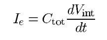
  

  

    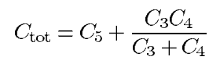
  

Detection of an ON edge causes Ie to be positive, supplied by Q12, whereas detection of an OFF edge causes it to be negative, supplied by Q11.

Choosing to detect ON edges only, we sense the current in Q12 with the diode-connected Q13 and use Ve to mirror copies of it to succeeding circuits. The circuit thus serves as a differentiating, amplifying, and half-wave-rectifying element all-in-one.

As long as Q12 is completely turned on, i.e., during sufficiently large ON edge transients, we can calculate the magnitude of the
resulting output current pulse as:

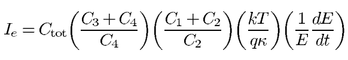

The output current Ie of the edge detector is then proportional to the temporal contrast , which is the product of the velocity and the spatial contrast , i.e.

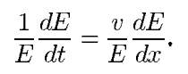

<h3>Pulse Shaping Circuit</h3>

The output current from the temporal edge detector is fed into the pulse shaping circuit. The pulse shaping circuit depends upon the motion circuit being used (i.e., FT or FS). The required output pulses from the pulse shaping circuit are:

The FT motion sensor uses a nonlinear filtering circuit to convert the current pulse from the edge detector into a thin voltage spike that is translated into a voltage pulse of fixed amplitude and width by a refractory neuron circuit. 

The FS motion sensor uses the same nonlinear filter to convert the current pulse from the edge detector into two signals, a thin voltage spike and a slowly decaying voltage signal. 

Thus, we require nonlinear filter and refractory neuron circuits as pulse shaping circuits.

<h4>Nonlinear Filter</h4>

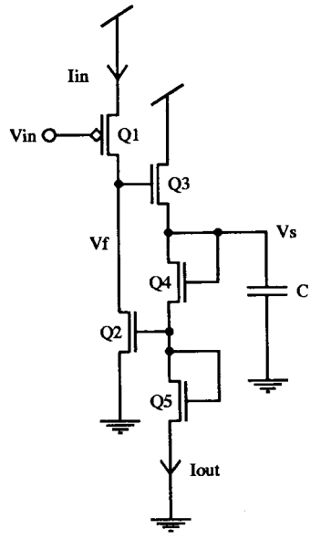

The input to the circuit Iin is a current proportional to Ie, obtained from the mirror formed by connecting the output voltage of the edge detector ( Ve) to Vin of the filtering circuit. In response to an input current pulse, two voltage signals are generated: The voltage Vf produces a sharp spike, while the voltage Vs responds with a sharp onset and a log(t) like decay. The input Iin may be thought of as an impulse that sets the initial condition on the diode-capacitor
subcircuit of Q4, Q5 and C. 

For an initial condition with a pulse amplitude of Io, the diode-capacitor current Iout is given by

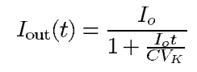

 After a sufficiently long time , such that Io*t >> C*Vk, Iout(t) = C*Vk/t,

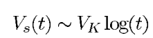

Note that the circuit does not have an explicit threshold for the value of Io where contrast-insensitivity begins. Neither does Vs have an explicit time constant determined by a bias voltage, since a diode-capacitor configuration intrinsically adapts to time constants over many orders of magnitude.

<h4>Refractory Neuron Circuit</h4>

The voltage Vp represents the membrane potential and rests at ground. The voltage Vn represents the state of activation of the sodium
conductance modeled by Q5-Q12 and rests at Vdd. The bias voltage Vl sets the leak current through Q4. The bias voltage Vd sets the pulse width of the output pulse. The bias voltage Vr sets the refractory period of the neuron or the minimum time between output pulses. 

<h3>Results</h3>

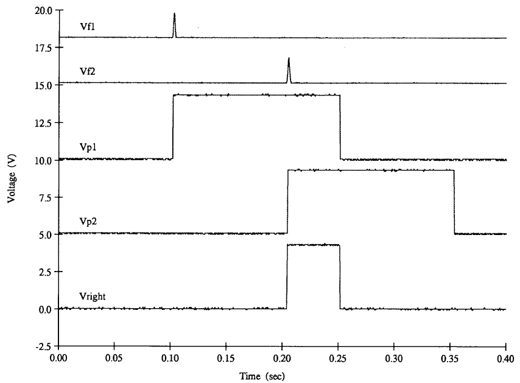

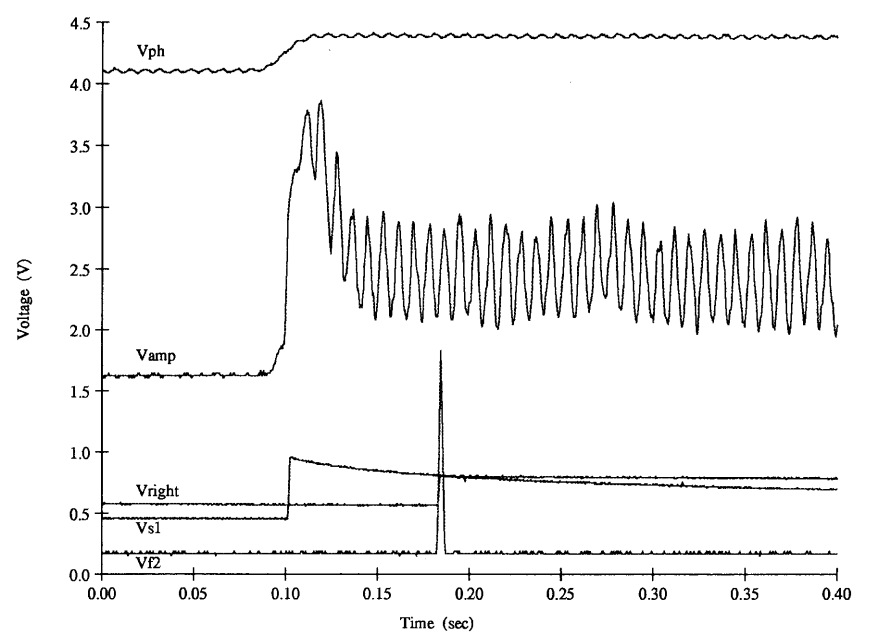

