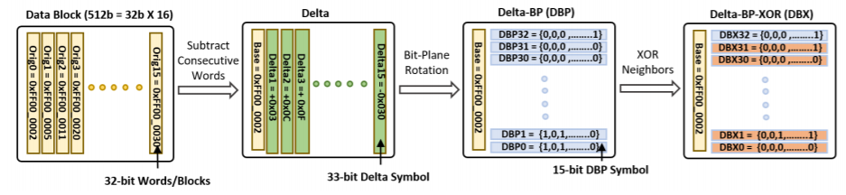
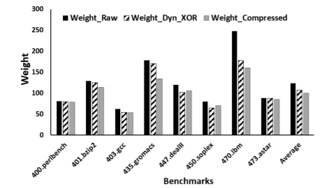
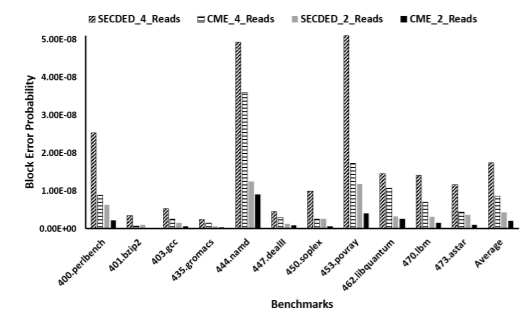

<h4><a style="color:navy"; font-weight:normal; href="https://nanocad.ee.ucla.edu/wp-content/papercite-data/pdf/w15.pdf"><u>Paper Referred</u></a>: Compression with Multi-ECC: Enhanced Error
Resiliency for Magnetic Memories</h4>
<h4>Authors: Irina Alam, Saptadeep Pal and Puneet Gupta</h4>
 
<h2>Why this research?</h2>

With the need for different properties (such as higher density, non-volatility, and higher performance) of memories, DRAM can’t be used for some applications. There are various candidates for replacing DRAMs such as PCM, STTRAM, and ReRAM. This research uses STTRAM because of zero leakage power and better endurance. 

However, there are many issues associated with this memory such as a) With read current getting comparable to the write currents at lower nodes because of the unidirectional read operation, the read operation can alter the stored value. Since the read operation is asymmetric, this error comes when reading a 1 (i.e., it can switch 1 to 0), b) the time required for writing a data is lesser for writing a 0 as compared to writing a 1. Thus, write error occurs when current is removed before 1 has been written, c) Thermal instability of STTRAMs causes the stored data to flip. This stability can be increased by increasing the write current, thus reducing the write time. While the first 2 errors can be reduced by reducing the weight of hamming code (i.e., reducing the no. of 1s). the third can be reduced by increasing the robustness (by increasing the area). 

<h2>The Paper</h2>
This paper proposes a new method for detecting and correcting errors in code while reading and writing data into STTRAM. The compression in code is important in the sense that it leaves bits for error detection and corrections schemes. Better the compression, better is the error correction possible. The paper proposes Compression with Multi-ECC (CME) approach, using a Bit plane compression (modified for 64-bit words) which consists of delta-BitPlane-XoR to transform the data & encoding (run-length encoding combined with frequent pattern encoding) to compress the data, and using different types of correcting techniques according to the no. of bits in the compressed data. The proposed methodology copies the cache line only once and uses the duplicated data only if the original data has an error. The paper discusses the final cache line lengths based on the range in which compressed line length lies, padding 0s for the remaining bits. 

Then, the authors prove how adding 4 bits to the code can increase its robustness and use Dynamic Programming to choose the 6 final codes. Another set of bits called tag bits is required to denote the compression and ECC techniques used on the original code. The paper discusses two methods for storing tag bits: to store these bits separately in the memory which would require the data to wait till these bits arrive (otherwise, the decoding of compressed data would have started after the first burst of data) causing latency overhead and second, to include these bits in the compressed cache line itself, causing ECC to store the compressed data in 8 lesser bits. 

The proposed methodology is evaluated against two design points in terms of write, read and retention error rates. The results show a reduction in hamming weight and thus, a reduction in block failure probability. 

It is observed that the failure probability increases when the hamming code is inverted (even though the inverted code has less weight). This is because the inversion requires an extra bit per word, reducing the no. of bits available for error detection & correction schemes. This issue is handled by using a single bit for multiple inverted words and thus, saving the bits for ECC techniques. 

The paper then discusses the overheads due to ECC schemes: area overhead is not significant when compared to the processor size and energy overhead is < 1% of per-bit read energy. For the scheme with separately stored tag bits, the proposed ECC decoding has no latency overhead while it is 1 cycle for the scheme with tag bits embedded into the cache line. Since the priority first word (intended to improve performance) cannot be implemented, it causes more latency overhead in both the schemes. 

The above methodology is compared with another compression scheme: BΔI. While this compression scheme reduces the hamming weight more efficiently than BPC and thus is expected to have lower error rates, BPC outperforms BΔI when the extra bits available after compression are used for error detection and correction methods. Then, the paper analyzes the reliability of using STTRAMs instead of DRAMs. While the STTRAM promises higher density and non-volatility over DRAMs, it requires ECC protection and has read, write and retention errors which can be much worse than transient bit errors in DRAM. But when the proposed protection scheme is used along with scrubbing, STTRAMs can be as reliable as the DRAMs. 

<h2>What Next? My two cents</h2>
If the code represents an integer, MSBs of the integers can have better error detection and correction schemes than LSBs. This way, if the correction method is unable to correct the code, there will be a minimal deviation from the actual value. For example, if the total compressed length is 46 bits, the 17 MSBs (after compression) can be represented with 19 extra bits for 3EC4ED and 29 LSBs can be represented with 7 LSBs for SECDED. This will require separate compression for MSBs and LSBs. When compared with using two codes each of 23 data bits and 13 extra bits for DECTED method, this method gives more emphasis on correcting MSB errors. This way, we can use a slightly deviated output if the intended application can bear some inaccuracy in the integer output.

