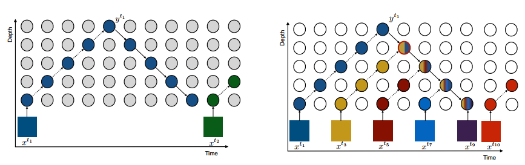
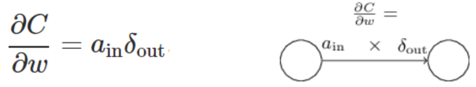
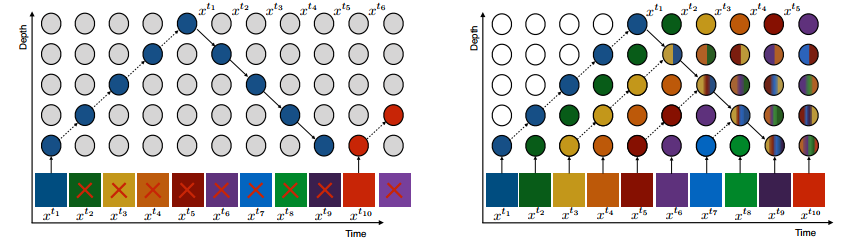
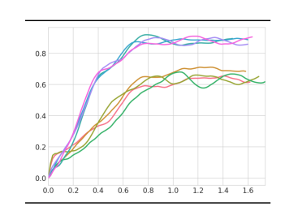
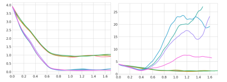

This blog talks about a recent improvement in the backpropagation in neural networks and was introduced by Google Deepmind in 2020. The paper being referred to is “*Sideways: Depth-Parallel Training of Video Models*” and can be found [here](https://arxiv.org/pdf/2001.06232.pdf). 

The basic idea is to use the time between the forward and backward passes of two consecutive inputs in a neural network, which was completely unused in the conventional backpropagation algorithm. 

While reading this paper, I realize how no one could think of this idea before? Just look at the below image and see how thoughtful and simple this idea is. 

It’s okay if this image does not click in the first impression. Read on, and I will try to explain as much as I could understand.

I am assuming that the reader is aware of the normal backpropagation algorithm used in neural networks. If not, a nice explanation can be found [here](http://neuralnetworksanddeeplearning.com/chap2.html).

What innovation the sideways algorithm brings is that while one input is being propagated forward and then backward in order to update the weights, the next input is not being used. The practical networks either skip some of the input samples in this time frame or wait for both the forward and backward passes to complete. This is clearly a waste of time that could be used. The reason this time could not be used is that in the conventional backpropagation, during the backward pass, the change in weight of a node in any layer is calculated by the activation fn. (calculated during the forward pass) and the derivative of cost w.r.t. weight (calculated during the backward pass). See the below equation for clarity:

Now, what sideways inherently assumes is that in any time series continuous data, some consecutive frames remain the same. Thus, the activation fn. due to these inputs will be approximately the same. So, we tweak our conventional backpropagation such that at every time sample, the new input is taken into the first layer and all the layers are propagated forward. On the side, the output cost fn. is calculated on the input which was N samples earlier (N being the no. of layers). Refer to the below image:

Now, for calculating any weight update, we see whichever latest backpropagated error is available at that time and multiply with the latest activation fn. Of the forward pass (Thus, the backpropagated error and the forward activation function are essentially of different input samples). The reason this is similar to the original backpropagation is that the input frames are continuous and thus, the activation functions and backpropagated errors won’t change much (except the frames near a change in the scene which can be ignored since that no. would be very small compared to the no. of total frames). 

“*Okay, so using sideways proves to be time-saving. But, is there any other advantage of why I should be using this?*” 

Well, yes. There is another improvement that we get which we may not have thought of while deploying sideways. When we keep on changing the inputs for updating the weights, the weights are not necessarily learning the feature of any particular input (since no weight update is dependent on any particular input, as opposed to conventional backpropagation which had every weight update to minimize the cost of every input). Thus, we are preventing our model to learn the intricacies of any particular input frames and thus, learn the overall features of the time series data. Or, to say in ML Lingo, we are introducing some sort of regularization in our model and thus, reducing overfitting. This effect is reflected in the tranining accuracy graphs as below:

<h2>What Next?</h2>

“*These seem to be all good flowers. But there has to be a thorn in it. Is there any hidden drawback that we could have been missing?*”

Yes, if we look closely, there are some drawbacks that may hinder the use of sideways in practical applications. 

For one, the loss function is pretty unstable, as seen in the following graph:

The reason for this instability is obviously that we are not calculating the loss function in the manner it should be. The minute changes in a frame to the next will cause some irregularity between the activation function and the error derivative to minimize the cost function. 

The reason this instability is a problem for us is that though the accuracy has improved (calculated by the no. of correct predictions), we have not considered the confidence in case of wrong predictions. According to this graph, the algorithm predicts with high confidence even if the prediction is wrong. However, in practical applications, we will prefer that the network should not be confident (i.e., the prediction probability should not be way above the threshold if the prediction is wrong). 

Second, The paper considers that conventional backpropagation has some sort of overfitting which is being regularized to some extent by the sideways. But, if we are able to reduce this overfitting in BP by techniques such as dropout and regularization (though this may not be practically possible, just considering the case here), will the sideways be able to match the BP accuracy since the weight updates in Sideways are noisy?

Third, the Sideways is applicable for only time-series data. How can we modify the algorithm to make it work for non-time-series data as well? In hindsight, we just need to introduce some correlation between the consecutive activation functions so that we can use a similar concept. There can be multiple ways that can be tested such as taking average of the last two/three inputs while calculating the activation function (and similarly, averaging last derivatives during the backward pass).

All in all, I think that this is a great concept for improving speed and accuracy. The improvement figures reported in the paper are groundbreaking. Since there will be more hardware resources required for implementing Sideways, this opens up for a lot of research in architectural implementation to increase resource sharing.

